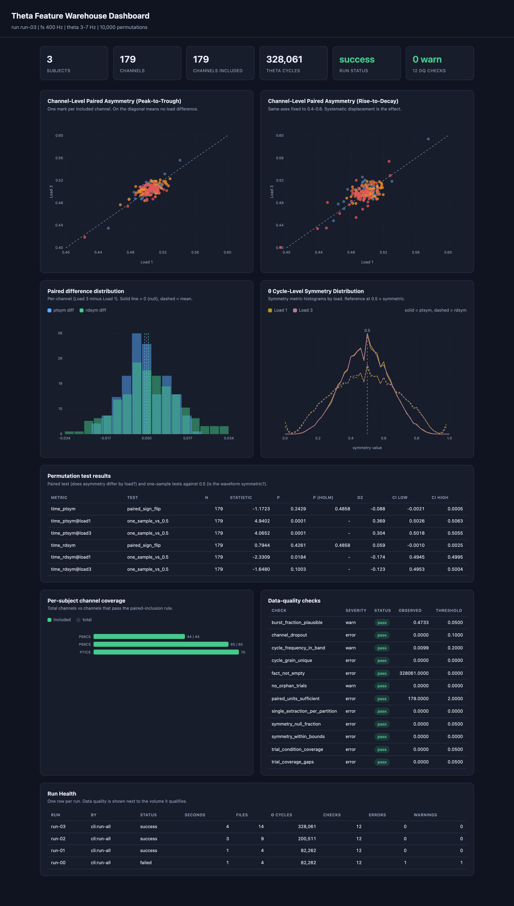

# theta-feat-warehouse

This repo is an Airflow-orchestrated ELT warehouse and analysis layer over the cycle-level
theta features produced by [`eeg-feat-ext`](https://github.com/khan-u/eeg-feat-ext).

`eeg-feat-ext` turns clinical iEEG into per-cycle waveform features and writes
them as timestamped CSVs. The aggregation, channel-level pairing, statistics and the reporting are all left as manual
steps in that repo's README. This repo now automates them - schedule, load, validate,
aggregate, test, publish. It also makes the result queryable in SQL and viewable in
Tableau.
[](https://public.tableau.com/views/iEEGFeatureWarehouse/Dashboard1_1)

*Interactive dashboard on [Tableau Public](https://public.tableau.com/views/iEEGFeatureWarehouse/Dashboard1_1): channel-level paired asymmetry (Load 1 vs Load 3), cycle-level symmetry distribution, and run health, built from the pipeline's CSV extracts.*

This pipeline also builds a self-contained offline dashboard (`make dashboard`) from
the same extracts - no server and no external libraries are needed.



*Offline dashboard: channel-level paired asymmetry, paired-difference and
cycle-symmetry distributions, per-subject coverage, data-quality checks, and run
health.*

```
sources                               theta-feat-warehouse (this repo)
─────────────────────────────        ──────────────────────────────────────────
eeg-feat-ext (MATLAB→RunBycycle)      discover  →  validate source contract
  or  SBCAT NWB via `nwb` bridge              ↓
  or  synthetic                       Parquet lake (partitioned, sorted)
        │                                     ↓
        └─────────── CSVs ───────────→ DuckDB: stg → core → mart
                                              ↓
                                      data-quality gate (12 checks)
                                              ↓
                                      permutation tests → extracts → dashboard
```

There are three interchangeable ways to produce the cycle-feature CSVs this repo consumes:
- the upstream `eeg-feat-ext` MATLAB/bycycle pipeline
- the built-in **NWB bridge** which reads the SBCAT release directly
- a synthetic data tool that emits fixtures for demos and CI. All three emit the same 27-column contract, so the warehouse code path is the same.

## Quickstart

```bash
python -m pip install -r requirements.txt
make demo
```

- `make demo` creates synthetic fixtures (byte-compatible with the real CSV
format, so no clinical data or download is needed) and runs the pipeline end to
end: the quality-check table, the test results, CSV extracts to
- `warehouse/exports/`, and a self-contained dashboard at `dashboard/index.html`.

Use this to see the pipeline run end to end without real data; use the NWB
bridge below for real data.

`make accrual-demo` runs the pipeline one subject at a time across successive
runs (run-01 sees one subject, run-02 two, run-03 all three), so Run Health
shows data accruing over time. Each accrual run's cycle
features and trial metadata are staged together, so it passes the quality gate.
`make accrual-real NWB=<dir|file>` does the same over the real SBCAT NWB LFP.
Pass `GAP=90` to space the run timestamps apart in wall-clock time.

`FAIL_DEMO=1` prepends one run the gate blocks: it fires while every subject's
trial log is already registered but only the first subject's cycle features are
ready, so `trial_coverage_gaps` fails and a real failed `run-00` is recorded
before any incomplete result reaches the marts. That failed run in the dashboard's
Run Health is the gate rejecting incomplete data, not a broken pipeline. The
committed dashboard image is built with `make accrual-real NWB=.. FAIL_DEMO=1`
(add `GAP=90` to also space the run timestamps for the Tableau view).

`make full` does the same on synthetic data at the reference scale of the source
study (32 subjects, 586 channels).


You can point the pipeline at real `eeg-feat-ext` output:

```yaml
paths:
  source_root: /path/to/eeg-feat-ext/data/cycle_features
  trial_metadata: /path/to/exported/trial_metadata
```

## NWB bridge (DANDI 000673)

The published dataset for the theta waveform-shape control is the SBCAT
release (Daume et al., *Control of working memory maintenance by theta-gamma
phase-amplitude coupling of human hippocampal neurons*) on
[DANDI 000673](https://dandiarchive.org/dandiset/000673). Its NWB files carry an
`LFPs` ElectricalSeries with *"spike potentials removed and downsampled
to 400 Hz"*; that's the intermediate signal `eeg-feat-ext`'s MATLAB
stage produces. So this bridge reads that LFP straight from NWB and skips MATLAB.

```bash
pip install dandi
dandi download https://dandiarchive.org/dandiset/000673
python -m theta_warehouse.cli nwb /path/to/000673   # or:  make real NWB=/path/to/000673
```

The full dataset is ~23 GB across 32 subjects and 586 hippocampal channels. In this repo, NWB files
are discovered recursively, so pointing `nwb` (or `make real NWB=...`) at the
`dandi download` root ingests every session's `sub-XX/sub-XX_ses-Y_*.nwb`.

`theta_warehouse.nwb_source` epochs each trial around `timestamps_Maintenance`
over `[-0.3, 2.8]` s, lowpass-filters, and runs `bycycle.compute_features` with
the parameters from `config/pipeline.yml` (using same extraction as
`RunBycycle.py`) then writes the 27-column CSV. Load condition and
accuracy come from the NWB `trials` table (`loads`, `response_accuracy`); the
electrode `location` is condensed to a region code (`Hipp`, `Amg`, `dACC`,
`preSMA`, `vmPFC`). And files without a continuous `LFPs` series are skipped with a logged reason.

## Layers

| Layer | Contents |
| --- | --- |
| **lake** | Parquet, `subject_id=.../region=.../extraction_id=.../part-0.parquet`, ZSTD |
| **stg** | Views over the lake; `latest_extraction` resolves re-runs |
| **core** | `fct_theta_cycle` (cycle grain, typed, condition joined), `dim_channel`, `dim_trial` |
| **mart** | `channel_load_asym`, `channel_paired_asym`, `cycle_qc_distribution`, `subject_coverage`, `run_health` |
| **ops** | `pipeline_run`, `source_file`, `dq_result`, `test_result` |

### Partitioning

Partitions are `(subject_id, region)`, and rows within each file are sorted by
`channel_label, trial, sample_last_trough`. Sorting by channel within each file lets Parquet row-group statistics
prune channel predicates, and the file count stays proportional to subjects x regions.

### Idempotency

Loading is delete-then-write at partition granularity, keyed on
`(subject_id, region, extraction_id)`. Core, marts and exports are full rebuilds.
Re-running any task converges to the same state rather than duplicating rows,
which is what makes `retries=2` in the DAG safe rather than a corruption risk.

## Data-quality gate

12 checks run after the fact table is built and **before** any result is
published; failing afterwards would publish numbers the pipeline has already
flagged as wrong. Each is a scalar SQL query, a comparison and a threshold,
persisted to `ops.dq_result` so quality is visible over time.

`error` severity fails the run. `warn` records and continues. The split reflects
whether a downstream number would be wrong or only worth checking.

| Check | Severity | Catches |
| --- | --- | --- |
| `fact_not_empty` | error | ingestion produced nothing |
| `cycle_grain_unique` | error | merged CSV ingested alongside region files |
| `single_extraction_per_partition` | error | de-duplication failed |
| `symmetry_null_fraction` | error | truncated or corrupt source |
| `symmetry_within_bounds` | error | column mapping wrong (both metrics are [0,1]) |
| `trial_condition_coverage` | error | metadata missing, or trial off-by-one |
| `trial_coverage_gaps` | error | trials in metadata with no cycles (coverage gaps) |
| `channel_dropout` | error | too many channels lost to the inclusion rule |
| `paired_units_sufficient` | error | fewer than two channels left to test |
| `cycle_frequency_in_band` | warn | fs or band mismatch vs config |
| `burst_fraction_plausible` | warn | thresholds leaving almost no burst cycles |
| `no_orphan_trials` | warn | trials in metadata with no cycles |

## Analysis

1. **Does asymmetry differ between conditions?** Per-channel means under each load
   form pairs; the statistic is the paired *t*, and the null comes from flipping
   the sign of each channel's difference. Holm-corrected across the
   two metrics.
2. **Is the waveform symmetric at all?** `time_ptsym` and `time_rdsym` are bounded
   on [0,1] with 0.5 meaning symmetric, so this is a one-sample test against 0.5
   in each condition.

A null on the first *with* symmetry on the second is the pattern that rules
waveform shape out as an explanation for a coupling difference. A null alone
does not, which is why every result carries an effect size (Cohen's *dz*) and a
bootstrap CI: a p-value alone does not distinguish no difference from
insufficient power.

The p-value uses `(1 + exceedances) / (1 + n)`, so it
is never exactly zero; a p-value of 0 would imply more resolution than the
permutation count supports. And channels are included only if **both**
conditions clear the minimum cycle count; dropping a channel from one condition
only would bias the paired difference.

## Dashboards

The pipeline exports flat CSVs to `warehouse/exports/`, and two reporting layers
read them:

- **Offline HTML dashboard.** `dashboard/build_dashboard.py` reads the extracts
  and writes a single `dashboard/index.html` with the four panels below rendered
  in inline SVG. It has no server and no external libraries, so it opens by
  double-clicking. `make dashboard` rebuilds it; `make demo` and `make full`
  build it as their last step.
- **Tableau workbook.** [`dashboard/TABLEAU.md`](dashboard/TABLEAU.md) documents
  the same four worksheets and the join model for a Tableau install. Uses CSV rather
  than a live DuckDB connection, because Tableau Public cannot reach a local
  database and not every Tableau install has the driver; the marts are
  pre-aggregated, so the extracts are small.

The four panels are: channel-level paired asymmetry (Load 1 vs Load 3),
paired difference distribution, cycle-level symmetry distribution by load, and run
health (run history, data-quality checks, per-subject coverage).

## Airflow

```bash
make airflow   # AIRFLOW_HOME=./airflow_home, DAG folder=./dags
```

`dags/theta_warehouse_dag.py` handles scheduling only - every task calls
into `theta_warehouse`, and every task has a CLI equivalent. Airflow's `run_id`
becomes warehouse `run_id`, so any row in `ops.*` or any exported CSV traces
back to the run that wrote it. `max_active_runs=1` because the warehouse is a
single DuckDB file and concurrent writers would corrupt it.

## CLI

```bash
python -m theta_warehouse.cli synth --profile full --effect 0.02
python -m theta_warehouse.cli nwb /path/to/000673   #  LFP -> CSV contract
python -m theta_warehouse.cli discover
python -m theta_warehouse.cli load
python -m theta_warehouse.cli transform
python -m theta_warehouse.cli dq
python -m theta_warehouse.cli analyze
python -m theta_warehouse.cli export
python -m theta_warehouse.cli run-all
```

## Layout

```
theta-feat-warehouse/
├── config/pipeline.yml            # paths, signal params, thresholds, DQ limits
├── dags/theta_warehouse_dag.py    # Airflow DAG (TaskFlow)
├── sql/
│   ├── 010_ops.sql                # schemas, ops tables, trial_metadata
│   ├── 020_stage.sql              # views over the lake, extraction de-dup
│   ├── 030_core.sql               # fct_theta_cycle, dim_channel, dim_trial
│   └── 040_marts.sql              # channel/load aggregates, QC, run health
├── src/theta_warehouse/
│   ├── schema.py                  # the 27-column contract
│   ├── naming.py                  # filename and directory conventions
│   ├── config.py                  # typed config
│   ├── db.py                      # DuckDB wrapper, SQL rendering, run registry
│   ├── ingest.py                  # discovery, contract checks, CSV → Parquet
│   ├── transform.py               # SQL orchestration + analysis
│   ├── dq.py                      # the check suite
│   ├── stats.py                   # permutation tests
│   ├── export.py                  # Tableau extracts
│   ├── synth.py                   # synthetic data tool
│   ├── nwb_source.py              # SBCAT NWB → CSV bridge (DANDI 000673)
│   └── cli.py
├── matlab/export_trialinfo.m      # exports the load condition from trialinfo (MATLAB path)
├── dashboard/
│   ├── build_dashboard.py         # builds the offline HTML dashboard from extracts
│   ├── index.html                 # dashboard (open in a browser)
│   └── TABLEAU.md                 # Tableau worksheet and join model
└── tests/
```

## Testing

```bash
make test
```

97 tests covering the permutation null calibration
(false-positive rate near alpha across 200 replicates, rather than a single seeded
p-value), agreement with `scipy.stats.ttest_rel`
on Gaussian differences, and byte-level fidelity of the synthetic data to
the real CSV format.

## Credits

Upstream feature extraction: `eeg-feat-ext` built on
[bycycle](https://bycycle-tools.github.io) (Cole & Voytek, *J. Neurophysiol.*
2019) and [NeuroDSP](https://neurodsp-tools.github.io). The analysis reproduces
the theta waveform-shape control from Daume et al., *Nature* (2024),
Extended Data Fig. 3c. Real data comes from the SBCAT release (Daume et al.,
[DANDI 000673](https://dandiarchive.org/dandiset/000673)); that dataset is
distributed under its own license by the Rutishauser lab and is not included here.

## License

BSD 3-Clause - see [`LICENSE`](LICENSE).
